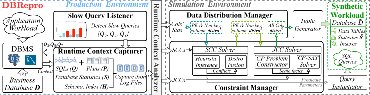

# DBRepro

DBRepro is an end-to-end framework for **high-fidelity reproduction of slow queries** under strict data privacy. Without access to raw user data, it synthesizes a **synthetic proxy database** from non-intrusive metadata only—schema, column-level catalog statistics, target SQL statements, and their physical execution plans—so that the test optimizer tends to choose the same physical plans as in production, enabling reliable offline diagnosis and tuning.



## Overview

DBRepro formulates database generation as a **constrained distribution synthesis** problem: it bootstraps a global data distribution from catalog statistics, extracts cardinality constraints from the execution context of the target queries, and progressively refines the distribution to satisfy those constraints while preserving global statistics as much as possible.

The pipeline is:

1. **Runtime Context Capturer**  
   Collects schema \(H\), statistics \(S\), slow queries \(Q\), and physical plans \(P\) from the production side. By supporting both direct query and histogram-based extraction, it can achieve O(1) time complexity independent of table sizes.

2. **Analyzer**  
   Converts raw plans into Annotated Query Plans (AQPs) and extracts declarative **cardinality constraints**, including Selection Cardinality Constraints (SCCs) and Join Cardinality Constraints (JCCs).

3. **Data distribution and constraint solving**  
   - **Data Distribution Manager**: initializes global distributions for primary-key and non-key columns from statistics.  
   - **Constraint Manager (hybrid solving)**: for SCCs, uses heuristic probabilistic inference and **distribution fusion** to enforce local cardinalities with minimal deviation from the original statistics; for JCCs, augments a Constraint Programming (CP) model with **Scaling Factors** to handle complex, non-unique joins and mitigate cardinality fan-out.

4. **Physical data generation**  
   Materializes the synthetic database \(\tilde{D}\) from the final distribution for isolated replay of slow-query behavior.

High-fidelity goals achieved include: schema consistency, statistical consistency, plan structural consistency, per-operator cardinality consistency, latency-proportion consistency on key operators, and limited generalization to unseen queries in the same distributional setting.

## Environment Setup

DBRepro currently supports PostgreSQL versions 12 through 16, as well as commercial databases like the KingbaseES V8 series.

To run DBRepro, ensure you have **Java** and **Maven** installed. The provided workflow commands rely on Maven to execute the underlying Java application.

```bash
# Verify your Maven and Java installations
mvn -version
java -version
```

*Note: For some specific configurations (like modifying the PostgreSQL source code for more accurate IndexScan cardinality identification), please refer to the upstream [Mirage README](https://github.com/DBHammer/Mirage/blob/main/README.md) for detailed instructions. If you are using KingbaseES, there is no need to modify the database source code.*

## DBRepro Workflow and Usage

The workflow for DBRepro follows a 5-step pipeline, incorporating statistical extraction and constraint solving based on the extracted statistics. Below are the standard 5 steps to run the DBRepro pipeline. You will need to replace the placeholders (like `<host>`, `<port>`, `<config.json>`, etc.) with your actual environment values.

### Configuration File (`config.json`)
Before starting the pipeline, you need to set up a JSON configuration file. It contains database connection details and directory paths. Here is an example configuration format:

```json
{
  "databaseConnectorConfig": {
    "databaseIp": "127.0.0.1",
    "databaseName": "ssb",
    "databasePort": "5432",
    "databasePwd": "postgres",
    "databaseUser": "postgres"
  },
  "queriesDirectory": "/home/DBRepro/dbrepro_ssb/queriesDirectory",
  "resultDirectory": "/home/DBRepro/dbrepro_ssb",
  "defaultSchemaName": "public"
}
```
- `databaseConnectorConfig`: Target database connection information.
- `queriesDirectory`: Path where your target SQL queries are located.
- `resultDirectory`: Path for storing the outputs of query analysis and generation.
- `defaultSchemaName`: Default schema for the database (e.g., `public`).

### 1. Statistics Extraction
First, extract the catalog statistics and schema information from the target database.

```bash
mvn exec:java -Dexec.mainClass="ruc.db.rsgen.RSGenMainCLI" \
  -Dexec.args="extract -h <host> -p <port> -d <database_name> -u <user> -w <password> -o <output_directory> -r direct-query"
```

*Note on the `-r` parameter:*
- `-r direct-query`: Executes direct aggregation queries on the target database to obtain information.
- `-r histogram`: Infers database information (such as `table_size` and column `min`/`max` values) directly from the database's built-in catalog statistics (histograms). This approach makes the extraction time independent of the actual number of rows in the tables, achieving **O(1) complexity** and minimizing the impact on the production database.

### 2. Prepare Stage (Query Analysis)
Parse the local execution plans.

```bash
mvn exec:java -Dexec.mainClass="ruc.db.DBReproApp" \
  -Dexec.args="prepare -c <config.json> -t <database_type>"
```

*Note: You can also specify an execution plan directory using `--local-plan-json-dir <plan_directory>`, or specify a single execution plan using `--local-plan-json <plan_file>`.*

### 3. Instantiate Stage (Constraint Solving)
Select the cardinality constraint solving stage. In this phase, DBRepro uses heuristic probabilistic inference to solve SCCs, and utilizes the Iterative Proportional Fitting (IPF) algorithm to reconcile potential conflicts between the extracted catalog statistics and the local cardinality constraints, ensuring accurate parameter instantiation.

```bash
mvn exec:java -Dexec.mainClass="ruc.db.DBReproApp" \
  -Dexec.args="instantiate -c <output_directory> --statistics <output_directory>/enhanced_column_statistics.json"
```

### 4. Data Generation
Generate the synthetic data, making use of the enhanced column statistics to ensure distribution consistency.

```bash
mvn exec:java -Dexec.mainClass="ruc.db.DBReproApp" \
  -Dexec.args="generate -c <output_directory> -o <data_output_directory> -n 1 -i 0 --statistics <output_directory>/enhanced_column_statistics.json"
```

### 5. Generate DDL and Indexes
Finally, generate the schema creation statements (DDL) and execute them to create the final synthesized database. You can either generate the DDL files for manual execution or have DBRepro automatically create the database elements.

```bash
# Generate DDL files
mvn exec:java -Dexec.mainClass="ruc.db.rsgen.RSGenMainCLI" \
  -Dexec.args="ddl -i <output_directory> -o <ddl_output_directory> -c <config.json>"

# OR directly create database elements
mvn exec:java -Dexec.mainClass="ruc.db.DBReproApp" \
  -Dexec.args="create -c <output_directory> -d <database_name> -o <ddl_output_directory>"
```

### Example Artifacts
In `src/test/resources/data/query-instantiation`, we provide example artifacts for both the TPC-H and SSB benchmarks. These files showcase the declarative cardinality constraints extracted after the query analysis stage, as well as intermediate artifacts generated during the hybrid constraint solving process.

## Built with Mirage

**DBRepro** uses the open-source [Mirage](https://github.com/DBHammer/Mirage) framework. We extend its capabilities by introducing global data distributions, scaling factors for complex joins, and integrating comprehensive catalog statistics to achieve high-fidelity slow query reproduction. 

For additional details on the base functionality (such as detailed configuration options or manual source code patches), please refer to the upstream [Mirage README](https://github.com/DBHammer/Mirage/blob/main/README.md).